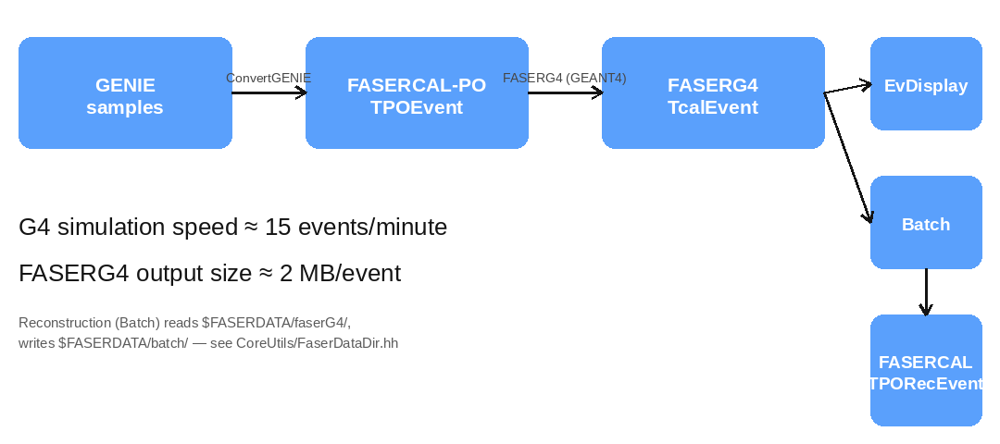
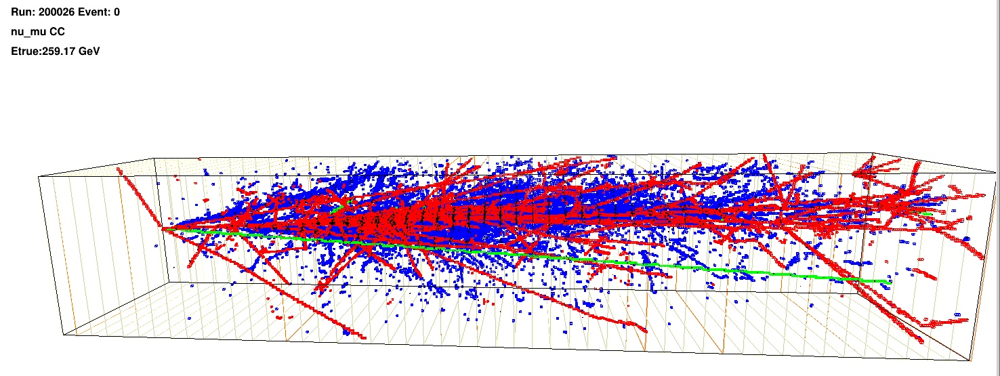

# FASER / FASERCAL — simulation and reconstruction

Simulation, reconstruction and analysis code for the FASERCAL electromagnetic/hadronic
calorimeter proposed for FASER Run 4, built on GEANT4 and ROOT.

This repository also includes **MuonDIS**: an on-the-fly, Pythia8-driven simulation of
muon-nucleon deep-inelastic scattering for the primary background muon, replacing the
standard Geant4 muon-nuclear final state. See [MuonDIS](#muondis) below for a quick
start, and [`FASERG4/README_MuonDIS.md`](FASERG4/README_MuonDIS.md) for full
physics/configuration details.

## Contents

- [Project layout](#project-layout)
- [Event data flow](#event-data-flow)
- [Prerequisites](#prerequisites)
- [Building](#building)
- [Running FASERG4 (`faserps`)](#running-faserg4-faserps)
- [MuonDIS](#muondis)
- [BatchReco](#batchreco)
- [DumpHits](#dumphits)
- [EvDisplay](#evdisplay)
- [FASERTuple / ConvertFASERMC](#fasertuple--convertfasermc)
- [TauSearch](#tausearch)
- [Event masks](#event-masks)
- [Run numbers](#run-numbers)
- [Reading ROOT files with PyROOT](#reading-root-files-with-pyroot)
- [Support](#support)
- [License](#license)

## Project layout

| Directory | Purpose |
|---|---|
| `FASERG4` | GEANT4 simulation (`faserps`): propagates primaries through the FASERCAL geometry, including the `MuonDIS` physics extension |
| `ConvertFASERMC` | Converts the official FASER Monte Carlo output into the `TPOEvent` truth format consumed by `FASERG4` |
| `ConvertGENIE` | Converts GENIE neutrino generator output into `TPOEvent` |
| `CoreUtils` | Shared data model (`TPOEvent`, `PO`, kinematics helpers) used across the whole chain |
| `Batch` | Batch reconstruction (`BatchReco`) and hit-dumping (`DumpHits`) executables |
| `EvDisplay` | Interactive ROOT/TGui event display |
| `Display` | Lower-level display utilities |
| `Analysis` | Analysis macros/scripts |
| `TauSearch` | Generator-level tau search analysis chain |
| `FASERCalProtoG4` | Earlier FASERCAL prototype GEANT4 model |
| `FileMask` | Event-mask/file-selection helpers |
| `GeomGDML` | Detector geometry in GDML format |
| `Python_io` | Examples for reading the ROOT output with PyROOT |
| `docs`, `images` | Documentation and figures used in this README |

## Event data flow

This project follows a structured workflow for simulating and processing neutrino (and
background-muon) interactions in FASERCAL using GEANT4. The process
begins with the FASERMC official Monte Carlo simulation, or with the on-the-fly MuonDIS
generator described below. These interactions are converted into the `TPOEvent` truth
format (by `ConvertFASERMC`, or produced directly by `FASERG4` for MuonDIS). `FASERG4`
then runs GEANT4 on the `TPOEvent` truth, producing `TcalEvent` simulated-detector
objects. These can be visualized with `EvDisplay` or processed in bulk with `BatchReco`.



## Prerequisites

Common tools:

- `git`, `cmake`, `make`, a C++17 compiler (`g++` or `clang++`)
- Boost
- Autotools (Automake, Autoconf, Libtool, M4, Perl) — needed for RAVE
- [ROOT](https://root.cern) 6.20+ (with GDML/Geom support)
- [GEANT4](https://geant4.web.cern.ch) 11.x, built with UI/Vis drivers and GDML support
- Pythia8 — required for MuonDIS (built automatically, see below)

On Ubuntu/Debian:

```bash
sudo apt update
sudo apt install build-essential git cmake automake autoconf libtool m4 perl \
                  libboost-all-dev
```

On macOS (with Homebrew):

```bash
brew install boost automake autoconf libtool cmake
```

## Building

1. Get the source code:

   ```bash
   git clone https://github.com/rubbiaa/faser.git
   cd faser
   ```

2. Set up your ROOT and GEANT4 environment, e.g. in a local `setup.sh`:

   ```bash
   source <ROOTINSTALL>/bin/thisroot.sh
   source <GEANT4INSTALL>/bin/geant4.sh
   ```

   ```bash
   source setup.sh
   ```

   On lxplus, use the provided setup script instead:

   ```bash
   source lxplus_setup.csh
   ```

3. Build the extra physics dependencies via the top-level `Makefile` (each target
   downloads/clones its source on first use and installs into `<name>-install/`):

   ```bash
   make pythia8      # required for MuonDIS (installs into pythia8312/)
   make clhep        # required for track fitting (GenFit/RAVE)
   make rave
   make googletest
   make genfit
   ```

   On macOS, `GenFit` needs its generated `.pcm` files copied next to the installed
   library to avoid ROOT dictionary errors:

   ```bash
   cp GenFit-build/bin/*.pcm GenFit-install/lib64/
   ```

   Run `make clean` to remove all of the above and start over.

4. Build `FASERG4` (the GEANT4 simulation, including MuonDIS):

   ```bash
   cd FASERG4
   mkdir -p build && cd build
   cmake ..
   make -j4
   ```

   This produces the `faserps` executable in `FASERG4/build/`. CMake looks for Pythia8 at
   `<repo-root>/pythia8312` (built in step 3) or at `$PYTHIA8`/`-DPYTHIA8_DIR=...` if it
   lives elsewhere; it warns (rather than failing) at configure time if the library isn't
   found yet, but `faserps` won't link without it.

5. Build `Batch` and `EvDisplay` the same way as any other subdirectory tool below (each
   has its own `Makefile`).

## Running FASERG4 (`faserps`)

`faserps` is configured entirely through a GEANT4 UI macro. Run it, from `FASERG4/build`,
against one of the example macros in `FASERG4/` (e.g. `runFASER_muondis.mac`,
`runFASER_muon.mac`, `runFASER_nuNC.mac`, ...):

```bash
cd FASERG4/build
./faserps ../runFASER_muondis.mac
```

Key run-time options common to the example macros: `/FASER/...` (detector geometry),
`/generator/...` (primary generation — ROOT-file input, single-particle mode, or
flux-sampled muon background), `/run/initialize`, and `/run/beamOn <N>`. See the macro
files themselves for concrete examples of each mode.

## MuonDIS

MuonDIS replaces the standard GEANT4 muon-nuclear final state for the primary muon with
an on-the-fly muon-nucleon deep-inelastic-scattering event, generated per interaction by
Pythia8 using the muon's actual GEANT4 energy and direction. It is **disabled by
default** — existing macros are unaffected unless they opt in.

Minimal example (see `FASERG4/runFASER_muondis.mac` for a full working macro):

```
# before /run/initialize -- MuonDIS commands issued afterwards have no effect
/physics/muondis/enable true
/physics/muondis/crossSectionBias 150
/physics/muondis/q2min 1.0
/physics/muondis/interactionLog muondis_interactions.csv
/run/initialize

/generator/wantMuonBackground true
/generator/singleMomentum 100
/run/beamOn 10
```

Other `/physics/muondis/...` options (nucleon PDF selection, minimum Bjorken-x cut,
verbose debug logging) and the full list of `/generator/...` primary-generation options
(flux file, minimum-energy cutoff) are documented in
[`FASERG4/README_MuonDIS.md`](FASERG4/README_MuonDIS.md), along with the physics
assumptions (isoscalar nucleon target, no Fermi motion/EMC effect, process choice, etc.)
and truth-level output added to `TPOEvent` (`nu`, `Q2`, `W2`, Bjorken `x`, `y`).

## BatchReco

Reads FASERCAL GEANT4 output and reconstructs events in batch, filling histograms.

```bash
cd Batch
make
./batchreco.exe <run> [maxevent] [mask]
```

| Argument | Meaning |
|---|---|
| `run` | Run number (see [Run numbers](#run-numbers)) |
| `maxevent` | Maximum number of events to process (default: `-1`, all) |
| `mask` | Restrict to one event type: `nueCC`, `numuCC`, `nutauCC`, `nuNC` or `nuES` (default: none) |

`batchreco_detresp.exe` (built from the same `Makefile`, `BatchReco_DetResp.cc`) runs a
variant reconstruction focused on detector response studies.

## DumpHits

A simple tool (also built from `Batch/`) that reads and dumps all hits from events.

```bash
cd Batch
./dumphits.exe <run> [maxevent] [mask]
```

Example — dump the first 10 `nueCC` events from the kaon-decay flux run:

```bash
./dumphits.exe 200026 10 nueCC > dump.log
```

## EvDisplay

Interactive ROOT-based event display for FASERCAL GEANT4 output.

```bash
cd EvDisplay
make
./evDisplay.exe <run> [mask]
```

Point it at your simulated data first:

```bash
ln -fs </path/to/g4_simulated_data> input
```

On `lxplus.cern.ch`, shared samples are available (request CERNBox access from André):

```bash
ln -fs /eos/home-r/rubbiaa/FASERCALDATA_v2.0 input
```

Examples:

```bash
./evDisplay.exe 200026 nueCC     # kaon-decay flux, nue CC events
./evDisplay.exe 200025 numuCC    # pion-decay flux, numu CC events
./evDisplay.exe 200035 nutauCC   # charm-decay flux, nutau CC events
```



## FASERTuple / ConvertFASERMC

`ConvertFASERMC` converts official FASER MC files into the FASERCAL `TPOEvent`
(generator-level) format consumed by `FASERG4`.

## TauSearch

A generator-level tau search analysis chain:

- `t.C` — converts a FASER ntuple into event-summary tuples
- `s.C` — analyzes event-summary tuples per tau decay channel, producing signal/background tuples
- `a.C` — reads the signal/background tuples per decay channel and runs a BDT analysis

## Event masks

Event masks restrict a job to one interaction type:

| Mask | Meaning |
|---|---|
| `nueCC` | nu_e charged current |
| `numuCC` | nu_mu charged current |
| `nutauCC` | nu_tau charged current |
| `nuNC` | any neutrino, neutral current |
| `nuES` | elastic scattering off a target electron |

## Run numbers

Run numbers follow the official FASER conventions:

| Run | Flux |
|---|---|
| 200025 | Pion decay (mostly nu_mu) |
| 200026 | Kaon decay (mainly nu_mu and nu_e) |
| 200035 | Charm decay (nu_mu, nu_e and some nu_tau) |

## Reading ROOT files with PyROOT

See the [`Python_io`](Python_io) directory for examples.

## Support

Questions or problems: open an issue at
[github.com/rubbiaa/faser/issues](https://github.com/rubbiaa/faser/issues).

## License

This project is licensed under the [MIT License](LICENSE). Note that several bundled
third-party dependencies (e.g. Pythia8 in `pythia8312/`, RAVE in `rave/`) are built from
their own upstream sources under their own separate licenses — see each dependency's own
`COPYING`/license file.
